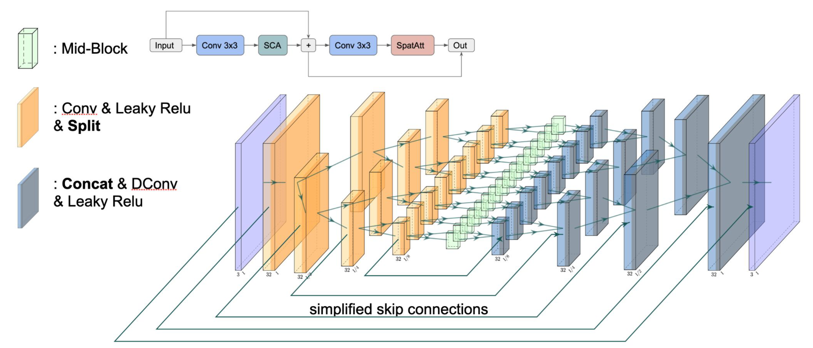
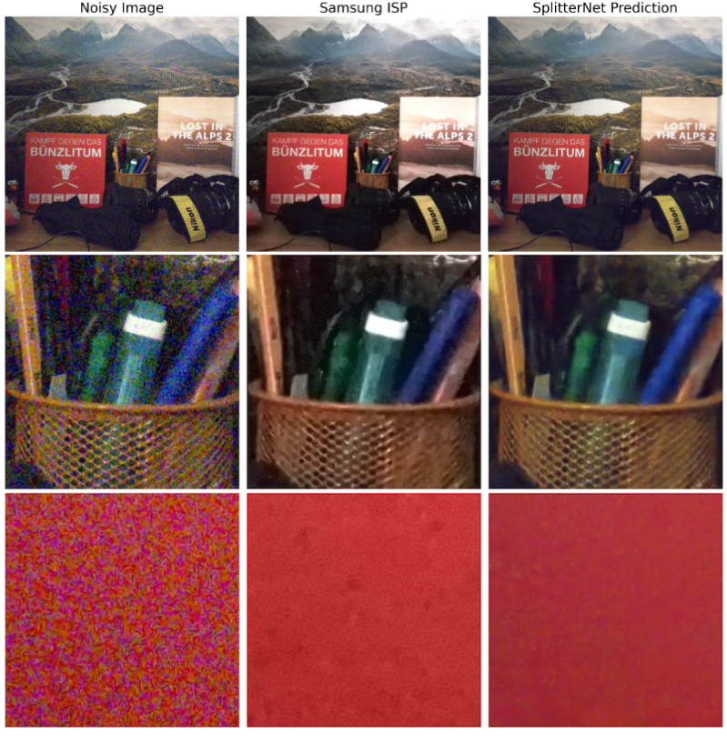
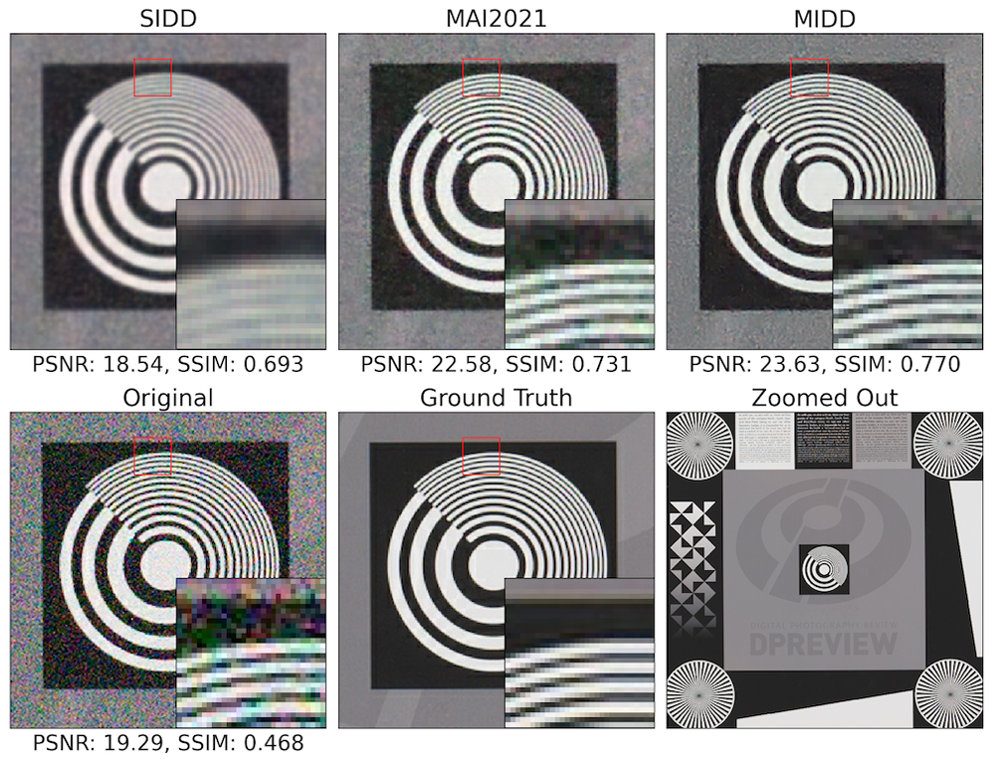

# SplitterNet and other Efficient Image Denoising Models

<p align="center">
  <a href="https://openaccess.thecvf.com/content/CVPR2024/papers/Flepp_Real-World_Mobile_Image_Denoising_Dataset_with_Efficient_Baselines_CVPR_2024_paper.pdf"></a>
  <a href="https://aiff22.github.io/midd.html"></a>
  <a href="https://download.ai-benchmark.com/s/Gq3n2cS7QkH7ZMz"></a>
  <a href="LICENSE.md"></a>
</p>

<p align="center">
  
</p>

<p align="center">
  Official implementation of the CVPR 2024 paper:<br/>
  <b>"Real-World Mobile Image Denoising Dataset with Efficient Baselines"</b>
</p>

---

## 📌 Table of Contents
- [Overview](#-overview)
- [SplitterNet Architecture](#-splitternet-architecture)
- [Included Models](#-included-models)
- [Repository Structure](#-repository-structure)
- [Prerequisites & Installation](#-prerequisites--installation)
- [Usage](#-usage)
  - [1. Training](#1-training)
  - [2. Evaluation](#2-evaluation)
  - [3. SLURM Cluster](#3-slurm-cluster)
  - [4. TensorFlow Lite Conversion](#4-tensorflow-lite-conversion)
  - [5. SIDD Benchmark Submission](#5-sidd-benchmark-submission)
- [Citation](#-citation)
- [License](#-license)

---

## 📖 Overview

This repository contains the official TensorFlow and PyTorch implementations of **SplitterNet** and **MoDeNet**, presented in our CVPR 2024 paper. Additionally, it provides a comprehensive suite of SOTA efficient mobile denoising networks optimized for TensorFlow Lite deployment, alongside baseline implementations from the [MAI 2021 Challenge](https://arxiv.org/pdf/2105.08629v1.pdf).

The associated **Real-World Mobile Image Denoising Dataset (MIDD)** can be downloaded here:
👉 **[Download MIDD Dataset](https://download.ai-benchmark.com/s/Gq3n2cS7QkH7ZMz)**

<p align="center">
  
</p>

<p align="center">
  
</p>

---

## 🏗 SplitterNet Architecture

**SplitterNet** is specifically engineered for high-performance, real-time image denoising on mobile devices. By strategically splitting tensor channels across stages and utilizing lightweight attention mechanisms (simple channel attention & spatial attention), it achieves superior trade-offs between PSNR/SSIM reconstruction quality and mobile execution latency on TensorFlow Lite.

---

## 🧩 Included Models

The repository provides modular, dynamic implementations in `models/`:

| Model | Description | Reference |
| :--- | :--- | :--- |
| **SplitterNet** | Proposed ultra-efficient mobile denoising architecture | Flepp et al. (CVPR 2024) |
| **SplitterNet_LN** | SplitterNet with layer normalisation | Flepp et al. (CVPR 2024) |
| **MoDeNet** | Proposed dynamic multi-scale efficient denoiser | Flepp et al. (CVPR 2024) |
| **Dynamic_PlainNet** | Dynamic implementation of PlainNet architecture | [NAFNet Paper](https://arxiv.org/pdf/2204.04676v4.pdf) |
| **Dynamic_UNet_simple** | Lightweight dynamic U-Net baseline | Baseline |
| **Megvii** | Winner of MAI 2021 Real-Time Image Denoising Challenge | [MAI 2021](https://arxiv.org/pdf/2105.08629v1.pdf) |
| **NOAHTCV** | Runner-up of MAI 2021 Real-Time Image Denoising Challenge | [MAI 2021](https://arxiv.org/pdf/2105.08629v1.pdf) |
| **PlainNet** | Standard PlainNet implementation | NAFNet |
| **ResNet_18** | ResNet-18 encoder with U-Net decoder | Baseline |

> **Note on Dynamic Models:** You can pass custom block configurations per U-Net stage (e.g. `--enc-blocks 2,2,4,8`) as well as customize filter counts.

All models can be built by name from Python:

```python
from models import build_model

model = build_model("SplitterNet", num_filters=32)
model.load_weights("model_weights/SplitterNet_MIDD_model.h5")  # pretrained on MIDD
```

---

## 📂 Repository Structure

```text
├── models/                  # Keras 3 model definitions and build_model() registry
├── model_weights/           # Pretrained SplitterNet weights (.h5)
├── sidd_submission/         # SIDD sRGB Benchmark submission preparation script
├── data_preprocessing/      # Parallel patch extraction and minimal ISP notebook
├── scripts/                 # SLURM cluster training & evaluation launch scripts
├── tests/                   # pytest suite (models, pretrained weights, data pipeline, training)
├── images/                  # Figures and visual result comparisons
├── train.py                 # Main training script
├── evaluate.py              # Model evaluation & PSNR/SSIM metric calculation
├── converter.py             # TensorFlow Lite model conversion script
├── dataloader.py            # tf.data pipeline & noisy/ground-truth pairing
├── utils.py                 # Custom losses (PSNR, L1, Edge, Charbonnier), metrics & callbacks
├── requirements.txt         # Package dependencies
└── README.md                # Project documentation
```

---

## ⚙️ Prerequisites & Installation

### Environment Setup
The code targets **TensorFlow 2.20+ with Keras 3** (tested with TensorFlow 2.21 / Keras 3.15) on Python 3.10–3.13. Clone the repository and install the dependencies:

```bash
# Clone the repository
git clone https://github.com/rflepp/SplitterNet-Efficient-Mobile-Denoising-Models-CVPR2024.git
cd SplitterNet-Efficient-Mobile-Denoising-Models-CVPR2024

# Create and activate virtual environment
python -m venv venv
source venv/bin/activate  # On Windows: .\venv\Scripts\activate

# Install requirements
pip install -r requirements.txt

# Optional: run the test suite
pytest tests
```

### Dataset Preparation
1. Download the [MIDD Dataset](https://download.ai-benchmark.com/s/Gq3n2cS7QkH7ZMz) or your target denoising dataset.
2. If uncropped, create 256×256 patches for the noisy and ground-truth images:
   ```bash
   python data_preprocessing/cropping_parallel.py dataset/uncropped/original dataset/patches/original_patches
   python data_preprocessing/cropping_parallel.py dataset/uncropped/denoised dataset/patches/denoised_patches
   ```
3. `train.py` and `evaluate.py` accept two directory layouts:
   * **flat**: `<dir>/original/` (noisy) and `<dir>/denoised/` (ground truth) with identically sorted file names;
   * **per scene**: `<dir>/<scene>/original_patches/` (or `original_20_patches/`, or `test_set/original/`) next to `<dir>/<scene>/denoised_patches/` (or `test_set/denoised/`). Files are paired by name; a `_file_<N>` burst index in the noisy file names is ignored, so several noisy captures can share one ground truth.

---

## 🚀 Usage

### 1. Training
```bash
python train.py --model SplitterNet --epochs 20 --batch-size 16 --filter-exp 5 \
    --dataset path/to/train/patches --test-dir path/to/test_set --output-dir runs/splitternet
```
Dynamic models additionally take `--enc-blocks 1,1,1,1 --dec-blocks 1,1,1,1`. Use `--checkpoint` to resume from a `.keras` checkpoint or to fine-tune from `.h5` weights (e.g. `model_weights/SplitterNet_MIDD_model.h5`). Checkpoints are written to `<output-dir>/checkpoints/` and the final model to `<output-dir>/trained_model.keras`. Run `python train.py --help` for all options.

### 2. Evaluation
```bash
# Trained .keras model
python evaluate.py runs/splitternet/trained_model.keras path/to/test_set
# Weights-only .h5 file (the architecture must be given)
python evaluate.py model_weights/SplitterNet_MIDD_model.h5 path/to/test_set --model SplitterNet
```

### 3. SLURM Cluster
Set `ABSPATH` in the scripts, then submit jobs with:
```bash
./scripts/run_training.sh SplitterNet 20 16 1,1,1,1 1,1,1,1 path/to/train/patches path/to/test_set 5 [checkpoint]
./scripts/run_evaluation.sh path/to/model.keras path/to/test_set [model name for .h5 weights]
```

### 4. TensorFlow Lite Conversion
Convert a model with a fixed input resolution to `.tflite` for mobile benchmark deployment:

```bash
python converter.py --model SplitterNet --weights model_weights/SplitterNet_MIDD_model.h5 --height 720 --width 480
```
Add `--optimize` for dynamic-range quantisation. The resulting file can be run with the [LiteRT](https://ai.google.dev/edge/litert) interpreter (`pip install ai-edge-litert`) or the PRO mode of the [AI Benchmark](https://ai-benchmark.com/workshops/mai/2021/#runtime) app.

### 5. SIDD Benchmark Submission
To evaluate SplitterNet on the official [SIDD sRGB Benchmark](http://130.63.97.225/sidd/benchmark_submit.php):

```bash
python sidd_submission/prepare_submission_srgb_sidd.py
```
This automatically downloads `BenchmarkNoisyBlocksSrgb.mat` if not present locally, performs inference using `model_weights/SplitterNet_MIDD_model.h5`, and generates `SubmitSrgb.mat` ready for submission.

---

## 📝 Citation

If you find SplitterNet or our MIDD dataset useful in your research, please cite our paper:

```bibtex
@inproceedings{flepp2024real,
  title={Real-World Mobile Image Denoising Dataset with Efficient Baselines},
  author={Flepp, Roman and others},
  booktitle={Proceedings of the IEEE/CVF Conference on Computer Vision and Pattern Recognition (CVPR)},
  pages={25774--25783},
  year={2024}
}
```

---

## 📄 License

Copyright (C) 2024 Roman Flepp. All rights reserved.  
Licensed under [CC BY-NC-SA 4.0](https://creativecommons.org/licenses/by-nc-sa/4.0/).  
*Released for academic research use only.*
